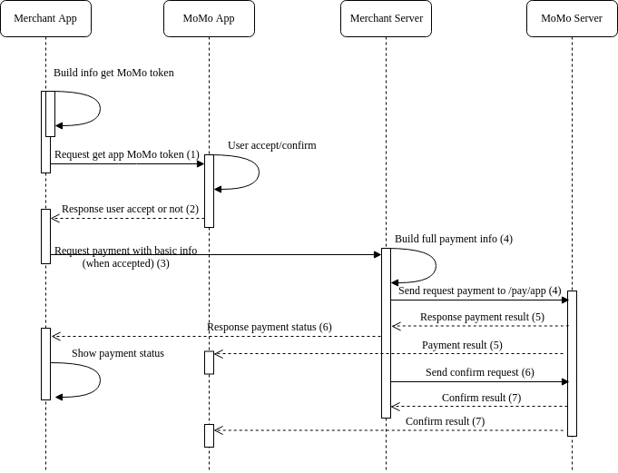

#App-In-App Payment

> Áp dụng cho partner có ứng dụng di động (Android/iOS) muốn mở trực tiếp ứng dụng MoMo để thanh toán.

## Business Account

Trước khi muốn liên kết với MoMo, partner sẽ phải đăng ký 1 tài khoản gọi là **business account**. Tài khoản này dùng để quản lý các giao dịch, thông tin tích hợp, v.v

## Process Flow



#### Step 1

App của partner sử dụng [MoMo Mobile SDK](https://github.com/momo-wallet/mobile-sdk) khởi tạo **deeplink** để mở app MoMo yêu cầu thanh toán với các tham số như sau

| Field             |  Type   | Required |                     Description                     |
| ----------------- | :-----: | :------: | :-------------------------------------------------: |
| action            | String  |    √     |       Giá trị là **gettoken**. KHÔNG THAY ĐỔI       |
| partner           | String  |    √     |       Giá trị là **merchant**. KHÔNG THAY ĐỔI       |
| appScheme         | String  |    √     | Cung cấp bởi MoMo, được lấy từ **business.momo.vn** |
| amount            |   Int   |    √     |               Tổng số tiền thanh toán               |
| description       | String  |    √     |                   Mô tả chi tiết                    |
| merchantcode      | String  |    √     |                     Mã partner                      |
| merchantname      | String  |    √     |                     Tên partner                     |
| merchantnamelabel | String  |          |     Label để hiển thị tên đối tác trên app MoMo     |
| language          | String  |          |          Giá trị là **vi**. KHÔNG THAY ĐỔI          |
| fee               | Integer |          |          Phí thanh toán.Mặc định là **0**           |
| username          | String  |          |            Định danh user (id/email/...)            |
| orderId           | String  |          |                Mã giao dịch đối tác                 |
| orderLabel        | String  |          |           Label để hiển thị Mã giao dịch            |
| extra             | String  |          |    Thông tin thêm nếu có. Format là Json String     |

#### Step 2

Sau khi khách hàng xác nhận thanh toán trên ứng dụng MoMo, MoMo callback lại ứng dụng của partner kèm theo dữ liệu như sau

| Field       |  Type   |                Description                 |
| ----------- | :-----: | :----------------------------------------: |
| status      | Integer |        Trạng thái xác nhận đơn hàng        |
| message     | String  |              Mô tả trạng thái              |
| data        | String  | Token thanh toán của MoMo (Nếu status = 0) |
| phonenumber | String  |        Số điện thoại tài khoản MoMo        |

Các **status** có thể có sau khi MoMo callback kèm theo thông tin cần thiết

| Status |                       Description                       |
| ------ | :-----------------------------------------------------: |
| 0      |           User xác nhận thanh toán thành công           |
| 5      | Hết thời gian thực hiện giao dịch (Timeout transaction) |
| 6      |                   User huỷ giao dịch                    |

###### Example

```
{
  "status": 0,
  "message": "Success",
  "phonenumber": "0963181714",
  "data": "v2/qml0PbOlrBYjFlZvXwRWjoMpmFmvqStTJt4DCXfE0cgMtyH5Akv+FxL2Nu8lDmxt0P3Mu+YeCGB+UFfwXICo7D07jR6f2VhauglozphNgkK7724sO3qVKC9ZI8KCdr0k4AHuuUNF4AT6Iy2rOmaCVF1WeyS/y/n2E4DArwaHG2J+8StiawfZPiKoUGvywNHV"
}
```

#### Step 3

Sau khi nhận được **token** từ app MoMo, server partner tạo request và gửi đến server MoMo để request authorization.

| Field          |  Type   | Required |                                         Description                                          |
| -------------- | :-----: | :------: | :------------------------------------------------------------------------------------------: |
| partnerCode    | String  |    √     |                                          Mã partner                                          |
| partnerRefId   | String  |    √     |                                   Mã giao dich của partner                                   |
| customerNumber | String  |    √     |                                Số điện thoại khách hàng MoMo                                 |
| appData        |   Int   |    √     |                                 Token nhận được từ app MoMo                                  |
| hash           | String  |    √     | RSA (jsonString (bắt buộc phải có **partnerCode**, **partnerRefId**, **amount**), publicKey) |
| version        | Double  |    √     |                                  Phiên bản, hiện tại là 2.0                                  |
| payType        | Integer |    √     |                                         Giá trị là 3                                         |
| description    | String  |          |                                     Mô tả cho giao dịch                                      |

###### Example

```
{
  "partnerCode": "MOMOIQA420180417",
  "customerNumber": "0966787273",
  "partnerRefId": "Merchant123556666",
  "appData": "v2/qml0PbOlrBYjFlZvXwRWjoMpmFmvqStTJt4DCXfE0cgMtyH5Akv+FxL2Nu8lDmxt0P3Mu+YeCGB+UFfwXICo7D07jR6f2VhauglozphNgkK7724sO3qVKC9ZI8KCdr0k4AHuuUNF4AT6Iy2rOmaCVF1WeyS/y/n2E4DArwaHG2J+8StiawfZPiKoUGvywNHV",
  "hash": "A7WFmmnpn6TRX42Akh/iC5DdU5hhBT9LR5QSG6rJAl70hfEkkGUx2pTCai8s+M9KMVUcJ7m52iv74yhmeEjjN10TtEJoqITBIYBG2bqcTprhDijyhV4ePU7ytDNuLxzzIvGfTYyvbsEJ2jZTSf556yod12vhYqOJSFL/U2hVuxjUahf5Rnu5R/OLalg8QmlU6nQooEuNdzEXPMd6j9EaxOCiB2oM5/9QiTN0tCNSTIVvPtnlHu5mIbBHChcwfToIL4IAiD1nbrlDuBX//CZcrZj6hFqjvU31yb/DuG02c3aqWxbZKZ8csOwF9bL30m/yGr/0BQUWgunpDPrmCosf9A==",
  "description": "Thanh toan cho don hang Merchant123556666 qua MoMo",
  "version": 2,
  "payType": 3
}

```

Sau khi server partner gửi request đến server MoMo nếu thành công thì MoMo sẽ response có dạng như sau

| Field     |  Type   |       Description       |
| --------- | :-----: | :---------------------: |
| status    | Integer |    Kết quả giao dịch    |
| message   | String  |    Nội dung chi tiết    |
| transid   | String  |    Mã giao dịch MoMo    |
| amount    |  Long   |   Số tiền thanh toán    |
| signature | String  | Sử dụng **Hmac_SHA256** |

#### Step 4

Để hoàn tấc giao dịch bên phía partner sẽ gửi request tới server MoMo nhằm mục đích là xác nhận giao dich với các giá trị tương ứng như sau

| Field          |  Type  | Required |                                             Description                                              |
| -------------- | :----: | :------: | :--------------------------------------------------------------------------------------------------: |
| partnerCode    | String |    √     |                                              Mã partner                                              |
| partnerRefId   | String |    √     |                                       Mã giao dich của partner                                       |
| requestType    | String |    √     | Loại request, có 2 giá trị: Xác nhận giao dịch: **capture** và hủy bỏ giao dịch: **revertAuthorize** |
| requestId      | String |    √     |                                 Id của mỗi request khi gọi qua MoMo                                  |
| momoTransId    | String |    √     |                                    Mã giao dịch MoMo đã trừ tiền                                     |
| signature      | String |    √     |                                       Sử dụng **Hmac_SHA256**                                        |
| customerNumber | String |          |                                       Số điện thoại khách hàng                                       |
| description    | String |          |                                             Mô tả lý do                                              |

###### Example

```
{
  "partnerCode": "MOMOIQA420180417",
  "partnerRefId": "Merchant123556666",
  "requestType": "capture",
  "requestId": "1512529262248",
  "momoTransId": "12436514111",
  "signature": "307b0ee753798e3aff6eb69b2d7966bf0fab29f88336ce0763532fcfafadbe28",
  "customerNumber": "0963181714"
}

```

Sau khi server partner gửi request đến server MoMo nếu thành công thì MoMo sẽ response có dạng như sau

| Field        |  Type   |       Description        |
| ------------ | :-----: | :----------------------: |
| status       | Integer |    Kết quả giao dich     |
| message      | String  |    Nội dung chi tiết     |
| partnerCode  | String  |        Mã đối tác        |
| partnerRefId | String  | Mã giao dich của partner |
| momoTransId  | String  |    Mã giao dịch MoMo     |
| amount       |  Long   |      Số tiền đã trừ      |
| signature    | String  | Sử dụng **Hmac_SHA256**  |

###### Example

```
{
  "status": 0,
  "message": "Thành công",
  "data": {
    "partnerCode": "MOMOIQA420180417",
    "momoTransId": "12436514111",
    "amount": 30000,
    "partnerRefId": "Merchant123556666"
  },
  "signature": "307b0ee753798e3aff6eb69b2d7966bf0fab29f88336ce0763532fcfafadbe28"
}

```
